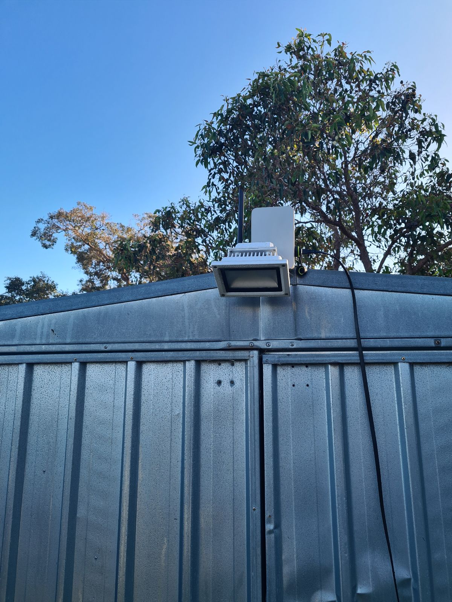
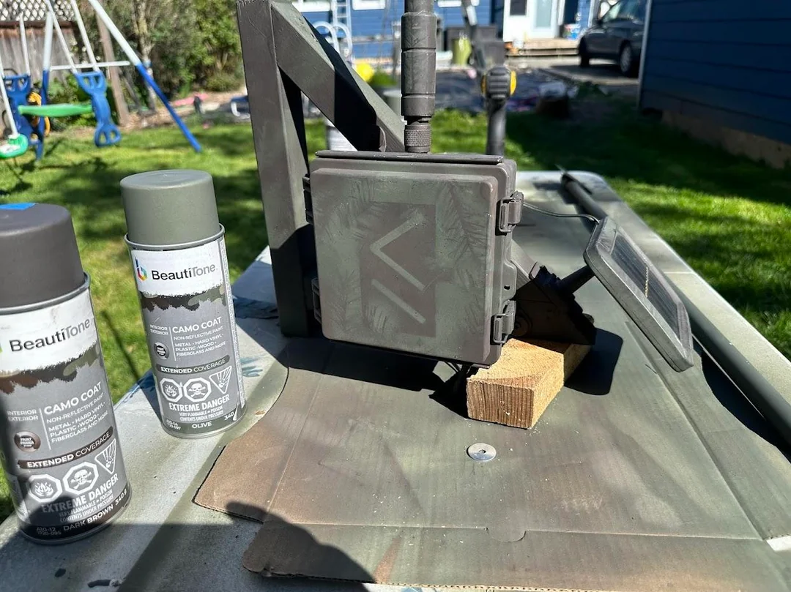
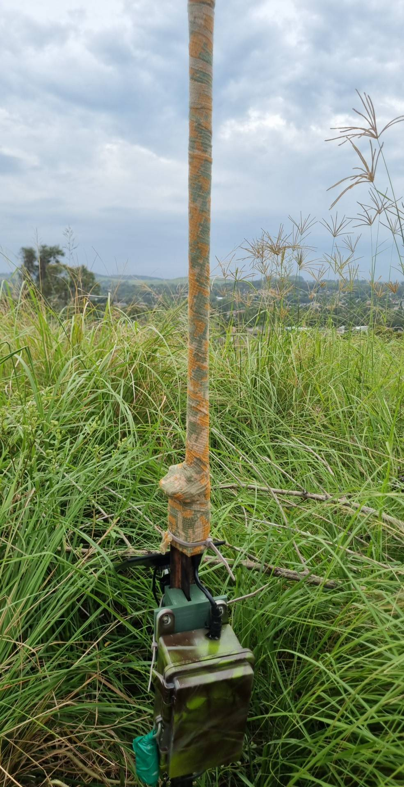
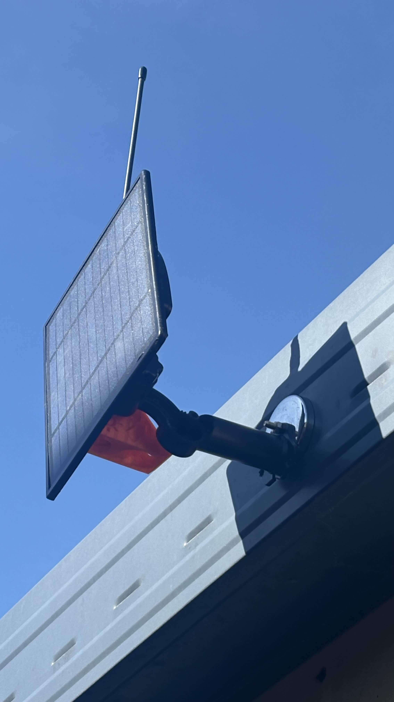
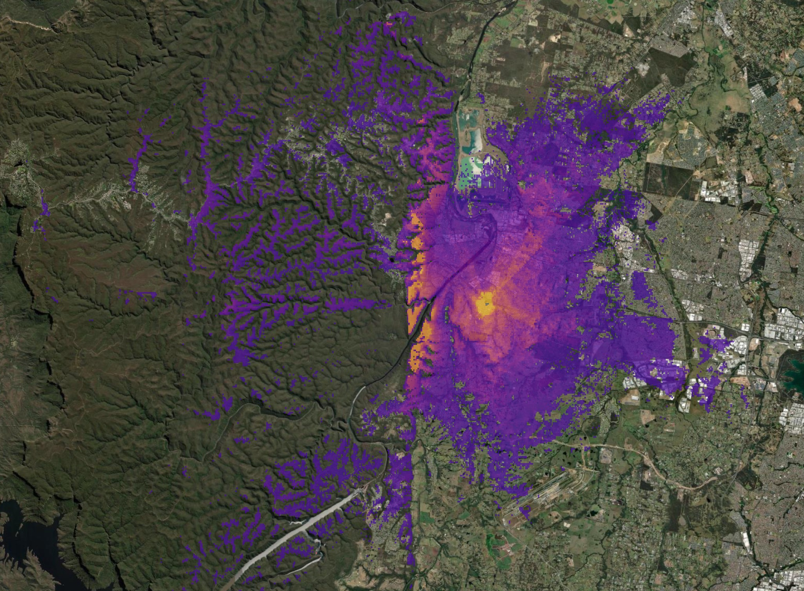

Meshtastic, is an open-source, off-grid communication platform using LoRa mesh networks, empowers users to stay connected without the need for internet or mobile phone networks (see Meshtastic.org for more info ) but you already knew that!

To extend your networks reach, you generally need to deploy router nodes in a high up locations. This can present problems, as many high locations are public, private or not easily accessible. Nodes may need to be deployed in public spaces, and you will need to prevent these nodes from being discovered and removed, either by authorities or by thieves. For those seeking to deploy nodes discreetly—whether for privacy, security, or resilience—clandestine placement is key. This article talks about creative and practical ways to conceal mesh nodes while ensuring optimal performance, along with essential safety tips to keep in mind. This article isn’t about building nodes or setting up Meshtastic. There is plenty of information on these two subjects on the internet in places like Youtube and the Meshtastic official site, and others.

**Node disguised as a Shed Light**

## Mastering Concealment Through Camouflage

The art of hiding a Meshtastic node begins with blending it into its environment. Camouflage is your first line of defence and our first way of hiding that node from prying eyes. Note the hardest part of your node to hide is the solar panel (if you have a solar powered node). Start firstly by doing a recon of the spot you wish to place the node, hopefully after you have done the necessary radio frequency (RF) simulation testing of the location to make sure the node has good coverage. Take photos and take note of the environment the node will be in. Make a mental note of colours and any objects you can hide the node on that will give you height and coverage, such as poles, trees, building structures or hill tops. Think where the node will go and accessibility to the spot.  This will not only give it good coverage but will you be able to hide it anywhere without it being obvious. Work out how you will mount your node as well. On a post in the ground, or up a tree, or attached to the side of an electrical box or building with magnets. A secure mounting point is essential. Once you have a spot go back to your node build.

Start by painting the node’s enclosure with camo spray paint using colours like greens, beiges or brown to match the surroundings, such as trees, grass and plants in the hiding spot. Paint the darker base colour first like the brown or dark green then use a tree or plant branch as a shield and spray the other colours on this to create a camouflage pattern. Work back from darkest colour to lightest colour. This helps the human eye not pick up solid objects with darker colours being in the back showing as a false depth.

**Camo spray paint using colours like greens, beiges or brown to match the surroundings, such as trees, grass and plants in the hiding spot**

If you intend to mount the node on urban infrastructure, use colours such as greys, blacks and silver.  Mask off solar panels to avoid painting over the solar cells, and paint screw heads and anything shiny to eliminate reflective metal that could catch the eye. The closer you can match the background colour the better.  Do not paint antennas as some paints contain metallic ingredients which will throw out the antennas tuning. Wrap antenna connectors well with amalgamation tape then electrical tape.  A well-camouflaged node, especially in natural settings like parks or bushland, becomes nearly invisible to passersby.

**Camo tape and camo netting can also be used to hide a node in foliage and trees**

Other options like camo tape and camo netting can also be used to hide a node in foliage and trees. The better you can hide your node, the harder it will be for others to spot it. Just remember, humans vision rarely goes upwards and people won’t notice a well camouflaged node hidden high above their line of sight. Humans in general are not that observant.

For urban environments, consider disguising the node as a piece of electrical equipment and hiding it in plain site. Mounting a node on a parking lot light pole with a magnetic base or inside a grey utility box can make it blend seamlessly with city infrastructure. Labelling it to mimic official equipment further deters curiosity. If you make it look enough like a piece of electrical equipment, people won’t question it even if it’s nowhere near a power line. Add a high voltage warning label for extra effect. Even simply hiding a node behind something so that it’s not able to be seen is super effe

## Strategic Placement for Coverage and Discretion

Choosing the right location balances LoRa coverage with concealment. High vantage points, like trees, building rooftops, up light poles or behind road signs, improves signal range due to better line-of-sight, which is critical for Meshtastic’s mesh protocol. For tree installations,  you can use 550 para-cord to hoist a camouflaged PVC enclosure out of reach, after launching the end over a branch, securing it in a branch crotch to obscure it from below. If you can climb a tree (and do so at your own risk) you can use a couple of long wood screws to secure a node to a tree trunk side. Also long poles can be used to get the node up to the top of a tree and have the solar panel in full sun. Lash this pole to the tree. Lengths of PVC or squid poles are good for this. Try and use well established trees as smaller ones sway in the wind which will cause problems to the node.  Ensure the antenna is at least 17 cm (about 6 inches) from the tree trunk to avoid signal interference.

Solar panels should at least face the sky or point to the north and be angled to avoid reflecting sunlight, at around 30 degrees which could give away the node’s position. Avoid shading solar panels by the trees canopy or other obstacles as this will greatly reduce charging. NRF52 boards, like RAK boards, are forgiving with panel angles, making this easier to achieve due to their lower power consumption. These are the preferred boards to use for clandestine solar style nodes. But it is better to over spec your panel and charge system then skimp. If you skimp, your node will slowly consume more than it charges and eventually shut down. Bigger battery capacity than you really need also helps fix this. Alternatively, integrate nodes into everyday objects found out in environments. A solar-powered garden lights can house a node, using a small antenna for discretion are cheap and easy to obtain from hardware stores or online. Smart birdhouses, increasingly common, are another clever disguise—equip them with a solar panel on the house roof and a node for a convincing cover. In urban settings, extend existing electrical boxes to conceal the node. Putting nodes in similar looking coloured boxes on nearby electrical boxes helps hide them. Adding strong magnets to node cases and installing them high up on the side of buildings, light posts and anywhere metallic high up is a clever way to get a node. Nodes magnetically attached to the back road signs with a small antenna sticking out above the sign is another popular way to hide nodes.

## Enhancing Security and Deterrence

Physical security is crucial to protect your node from tampering or theft. Use tamper-proof screws or locks and chains on enclosures to deter unauthorised access. Even having nodes fixed with U- Bolts on a pole means potential thieves need tools to remove your node which is a deterrent. For hard-to-reach placements, consider obstacles like high trees or difficult terrain to discourage casual interference. A lot of people may be deterred by seeing how much time/resources it would take to get it vs potential reward. Many thieves will not even be aware of what they are taking, and just take a node for the easy challenge. So make it hard. Official looking stickers from government departments may also deter the dumber thieves and authorities from removing a node. Add trackers such as Air Tags to inside of nodes to help them be recovered. Secure nodes well enough so the elements and wildlife will not take them out as well. Cockatoos are known destructive birds and will enjoy destroying a node till it falls apart.'

**For urban environments, consider disguising the node as a solar light**

For data security, never set a nodes precise locations. Meshtastic allows control over location precision, so set a fixed GPS location somewhere not to close nearby the actually node location and then have a larger node precision distance set. Meshtastic will make a circle on the map of say 1.5km and your node will be somewhere in this circle. Use this on public channels to prevent sharing precise coordinates. If creating a private primary channel with a unique Pre-Shared Key (PSK) to share location only with trusted parties. Regularly monitor node performance via another Meshtastic node to detect anomalies, such as voltages and last heard times ensuring the device remains operational and secure.

## Power and Testing for Reliability

If using solar power, select a weatherproof, non-metallic enclosure to protect charging components while maintaining signal integrity. Position solar panels for maximum sunlight exposure without compromising concealment. Best faced to the north in Australia and around 30 degrees angle upwards to capture the most sun light during the day.  Before permanent deployment, test the node’s functionality to make sure it will go the distance. You can do this at home for a few weeks to make sure the node will handle a day with overcast weather.

**The Meshtastic Site Planner, a free tool, can simulate signal range based on terrain and obstacles, helping optimise placement at your remote location.**

##  Node Case Design for Stealth

A simple electrical box is a popular option for nodes and simple enough to paint. But with some thinking outside the box you can use other containers to help hide a node. If you have access to a 3D printer then the sky is the limit. There are plenty of free designs for nodes online. Be sure to make sure these 3D printed cases are water proofed. You can easily fit a small node and battery and antenna inside a piece of PVC piping that can look like other pipes and antennas mounted on a building. If adding a clandestine node on a building take a look at fittings and electrical boxes, cameras and anything else that could be a node case that could be replicated.

Antennas for Meshtastic should be vertical polarised but this can mean an antenna can point down as well and still work the same as if it were upright. This design allows for node cases to be attached to a rope and hauled up a tree with the antenna pointing downwards. Solar panels are not restricted to being fixed to a node case and you can run a longer wire between a solar panel and a node to help hide the node’s location compared to the panel.

Some nodes such as the Seeed XAIO are so small they could be easily put into a small container the size of a tuna tin and hidden on top of a location with a solar panel and a small antenna. Node cases must be water proof and be able to withstand the elements. A breather hole is also a good idea to stop humidity building up inside the case. Consider researching into Geocache containers as some of these make the best clandestine node containers.

**For urban environments, consider disguising the node as a piece of electrical equipment and hiding it in plain sit**

##  Safety Tips for Deployment

Safety is paramount when deploying clandestine nodes. When climbing trees or poles, avoid excessive heights—perfect concealment isn’t worth a fall. Use proper climbing gear and ensure secure mounting to prevent equipment from falling. Always attach an antenna before powering the node to avoid damaging the device. When handling spray paint or soldering components, work in a well-ventilated area and wear protective gear to avoid inhaling fumes or burns. Double check power wire polarity on the node board before connecting power from batteries or solar regulation boards. When placing nodes on private property always try to obtain the owners permission first. On public land you can try obtain permission but you will mostly get a NO, so place nodes on government or public land at your own risk. Many people have had nodes removed by authorities.

##  Final Thoughts

Deploying a clandestine Meshtastic node combines creativity, planning, technical know-how, and caution. By camouflaging enclosures, choosing strategic locations, securing the device, and prioritising safety, you can build a robust, discreet mesh network. Whether hidden in a tree, disguised as a utility box, or tucked into a birdhouse, your node can provide reliable off-grid communication while staying under the radar. Think outside the box. Think how easily could a node in this spot be noticed, and how easily it could be removed by either thieves or authorities. Then work out ways to prevent these.

**- Happy Meshing – David VK2FRT .**
